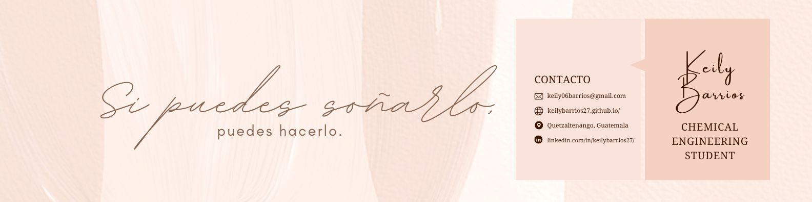
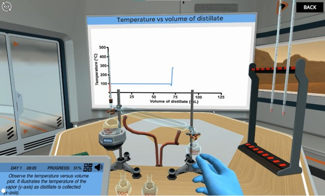

<h1 align="center">Hola, soy <a href="https://www.linkedin.com/in/keilybarrios27/">Keily Barrios</a> 👋</h1>

## Sobre mi
¡Hola! Soy una estudiante de ingeniería química apasionada por el aprendizaje y la exploración de nuevas experiencias. Siempre estoy buscando oportunidades para adquirir conocimientos y ampliar mis horizontes. Me encanta sumergirme en los desafíos que mi carrera me presenta y presentar soluciones innovadoras. 

Mi interés se enfoca en la industria agrícola, agroalimentaria, textil y de cosméticos, ya que considero que son sectores fundamentales para el desarrollo sostenible y el bienestar de las personas. Estoy emocionada por contribuir a estos campos y marcar la diferencia con mi trabajo.
 
- 📍Originaria de Quetzaltenango, Guatemala.
- 🎥 Te enseño sobre química en el laboratorio virtual de Labster [Youtube](https://www.youtube.com/@kei222/featured)
- ✏️ Puede contactarme en [LinkedIn](https://www.linkedin.com/in/keilybarrios27/)
 

## Videitos *Virtual Lab*

<table>
<tr>
<td width="50%">
<h3 align="center">Destilación Simple: Reciclaje de residuos de la producción de biodiesel</h3>

En esta simulación, la misión es <strong>usar la técnica de destilación</strong> para separar y reciclar los compuestos de desecho generados por la producción de biodiesel a partir de algas (agua, glicerol y metanol) para que puedan ser reutilizados.

                                                                                      
</td>

<td width="50%">
                
<h3 align="center">Cinética de reacción: lo esencial del laboratorio virtual</h3>

                                       

 

Esta simulación busca enseñar <strong>los principales factores que influyen en la velocidad de una reacción química</strong>. Sin embargo, la reacción cambiada afecta la cantidad de calor que se genera. Así que debemos sumergirnos en los diagramas de energía potencial para descubrir qué pasa allí. 

                                                             
</table>                                                                                 

 

### ⚙️ &nbsp;GitHub Analytics

